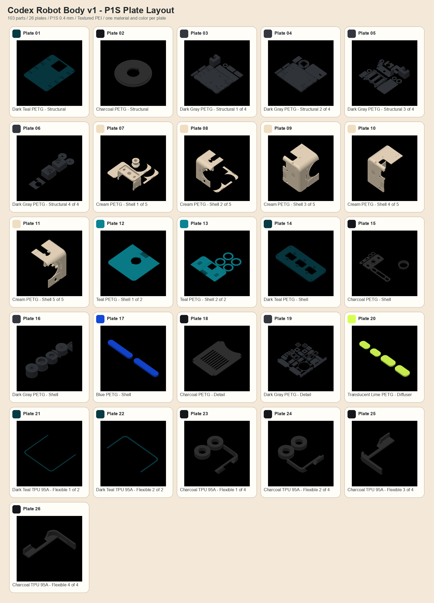

# Bambu Studio P1S project

The tracked [`codex_robot_body_v1_p1s.3mf`](codex_robot_body_v1_p1s.3mf)
is the canonical Bambu Studio layout project for a Bambu Lab P1S with the
standard 0.4 mm nozzle and a Textured PEI Plate.

It contains all 101 canonical printable parts exactly once on 26 named plates.
Each plate contains one material-profile/color group; no plate mixes PETG and
TPU or combines colors. The project carries nine physical filament/color
presets and uses a conservative global baseline of four walls and 25% gyroid
infill. The per-plate recommendations in
[`codex_robot_body_v1_p1s_plates.json`](codex_robot_body_v1_p1s_plates.json)
remain authoritative for layer height, wall count, and infill.

Regenerate the canonical STLs and project with:

```bash
.venv-cad/bin/python cad/python/robot_body_print.py
.venv-cad/bin/python cad/bambu/generate_bambu_project.py
```

The generator resolves the installed Bambu Studio machine, process, PETG, and
TPU presets into full CLI profiles, imports the canonical STLs through Bambu
Studio, packs them with brim-aware clearance inside an 8 mm edge reserve, and
round-trips the result through Bambu Studio. It then checks the P1S profile,
0.4 mm nozzle, 256 mm plate, Textured PEI selection, plate grouping, bounds,
packing-envelope separation, and the exact 101-part inventory.

This is an editable layout project, not pre-sliced G-code and not a hardware
release waiver. Review every plate in the current Bambu Studio slicer before
printing. Honor the release status in the plate manifest, print the calibration
coupons first. The rear drivetrain is drawing-backed to selected Pololu motors,
metal brackets, and aluminum hubs; the head targets two Hitec D85MG servos,
R-ML24 horns, a 6807 pan bearing, and an MF84ZZ passive-tilt bearing. Both still
require delivered-part inspection and loaded testing. The IDEC XW1E E-stop and
Omron D2HW bumper interfaces are also drawing-backed but remain gated on exact
coupons and deterministic cutoff tests. The two Pololu regulator patterns and
Albright SW60 mechanical carrier are now explicit, but still require
purchased-part, thermal, wiring, and electrical-safety review. Select and
measure the battery, LEDs, distribution hardware, and rear connectors before
committing to the full body.


