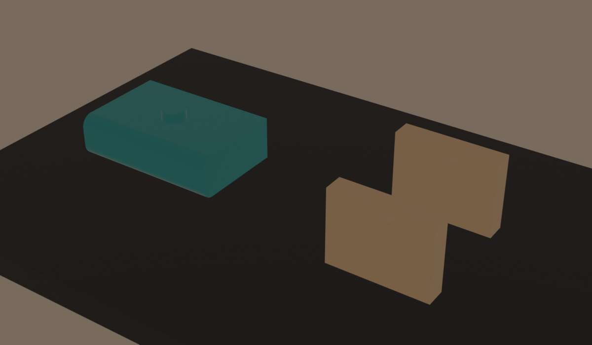

# CAD Calibration Coupons

The body model now generates seventeen small calibration parts from the same
build123d parameters used by the production geometry. Print these before a
shell, tray, mobility pod, or large service part. A ten-minute coupon is much
cheaper than discovering that every insert hole has developed opinions.

## Generate

```bash
.venv-cad/bin/python cad/python/robot_body_coupons.py --bed 256 --margin 8
/Applications/Blender.app/Contents/MacOS/Blender -b --python cad/blender/render_coupons.py
/Applications/Blender.app/Contents/MacOS/Blender -b --python cad/blender/render_alignment_pilot.py
```

Generated STLs and `codex_robot_body_v1_coupon_manifest.json` are written to
the ignored `cad/exports/coupons/` directory. The manifest is authoritative for
station positions and dimensions.




## Coupon inventory

Station sequences run left-to-right when the single rectangular notch is at
the lower-left. Insert and 608 stations also use tactile marker holes; the
larger 6807 block uses separate outer-seat and journal rows.

| Coupon | Stations or test |
| --- | --- |
| M3 insert | 4.2, 4.4, 4.6, 4.8, 5.0 mm holes |
| M2.5 insert | 3.4, 3.6, 3.8, 4.0, 4.2 mm holes |
| Fastener clearance, M3 row | 3.0, 3.2, 3.4, 3.6, 3.8 mm holes |
| Fastener clearance, M2.5 row | 2.5, 2.7, 2.9, 3.1, 3.3 mm holes |
| 608 bearing seat | 22.2, 22.4, 22.6 mm seats, each 7.8 mm deep with an 8.6 mm shaft passage |
| Koyo/JTEKT 6807 pan bearing | Outer-seat row: 46.8, 47.0, 47.2 mm at 7.4 mm depth. Rotating-journal row: 34.6, 34.8, 35.0 mm for the 35 mm inner ring. |
| Wall thickness | 2.4, 2.8, 3.2 mm walls on one base |
| Lid lap pair | Actual front tongue and rear lip clipped from the production 12 mm stepped seam |
| Split-pilot trio | One actual 4 mm shell-plate pilot and the two matching production half-round recesses; 0.3 mm radial and 0.4 mm axial clearance |
| Bumper interface tray | Exact clipped production front-left tray edge with D2HW body/side-lead pocket, paired rigid-stop clearances, and two blind M3 insert paths |
| Bumper interface plate | Exact 22 x 40 x 4 mm production PETG plate with two tray paths, the Omron 13 mm switch pattern, recessed screw heads, and both rigid overtravel stops |
| Bumper interface TPU | Exact clipped production bumper inner wall and local switch-plate relief; print with the candidate production TPU profile |
| Flush-fairing shell | Exact clipped cream-shell corner with the production 2.2 mm recess, 1 mm backing wall, and one M3 boss/path |
| Flush-fairing skin | Exact clipped 2 mm cream wheel-arch skin corner with 0.3 mm perimeter clearance and 0.2 mm nominal depth gap |
| Blue Sea 5045 fit gauge | One-piece production-derived 92.5 x 43.8 x 32.5 mm retail-block envelope with both 4.5 mm paths on 65.1 mm centers and the current deck orientation; mechanical preflight only |

The generator validates 32 modeled openings, six bearing shoulders, all
seventeen single-solid exports, first-layer contact, bed fit, exact lid-lap
reconstruction, full pilot-to-plate fusion, zero pilot/recess blockage, exact
production reconstruction for all three bumper coupons, zero assembled
tray/plate/TPU overlap, both open M3 paths, zero rest preload, and nominal
worst-case D2HW actuation after 2 mm of TPU-wall travel, paired stop contact at
2.4 mm, no total-travel bottoming, and all four plate/switch screw paths. It also proves exact
production reconstruction for both fairing coupons, free insertion through the
nominal 0.2 mm depth gap, and positive backing-floor contact after another
0.1 mm of test overtravel. The distribution-gauge validator also proves the
current Blue Sea 5045 envelope, orientation, two-hole spacing, deck paths, and
surrounding mechanical clearances.

## Test protocol

1. Use the intended production printer, nozzle, filament brand/color, layer
   height, wall count, cooling, and print orientation.
2. Dry the filament and let every coupon return to room temperature before
   measuring or fitting hardware.
3. Measure each station with calipers and record both modeled and printed
   dimensions. Do not choose from feel alone.
4. For heat-set inserts, install one insert per candidate using the planned tip
   and temperature. Choose the smallest station that seats straight without
   splitting or bulging the wall and survives repeated screw installation.
5. For clearance holes, use the actual screw lot. Choose the smallest station
   that passes freely after cooling without drilling or forced threading.
6. For the 608 bearing, press squarely with a vise or arbor tool—never hammer
   against the race. The selected seat should retain the outer race without
   cracking, distortion, or detectable rocking.
7. For the 6807, use the same purchased bearing across all stations. Select an
   outer seat that retains the outer ring without race distortion and a journal
   that slides through the inner ring without binding or perceptible radial
   play. Record both selected dimensions; never push load through the balls
   while pressing either race.
8. Assemble the two lid pieces. The tongue should engage by hand without
   forcing, visible step mismatch, or a loose rattle.
9. Butt the two thin split-pilot shell coupons together, align the round
   recess, and seat the plate coupon by hand. Cycle it at least ten times. It
   should enter without tools or whitening the wall, locate without visible
   rocking, and release without prying. If not, adjust the shared radial or
   axial clearance and regenerate all split and coupon exports.
10. Print the bumper tray and plate coupons in their specified PETG profiles and
   the bumper coupon in the candidate production TPU profile. Install two M3
   inserts from the tray underside, fasten the plate upward without touching
   the TPU, and mount a purchased Omron D2HW-C202MR using its two M3 stations.
   Confirm the 0.4 mm nominal rest gap, no preload, reliable circuit opening by
   the 2 mm nominal stroke, positive contact with both rigid stops near 2.4 mm,
   no plunger bottoming, side-lead strain relief, rebound, and repeatability.
11. Print both flush-fairing coupons in the intended cream PETG profile and
   orientation. The rounded skin corner must enter the shell recess by hand
   without scraping, whitening, or rocking. Install one M3 screw and confirm
   the seam clamps flush without bowing the 2 mm skin. If it binds or remains
   proud, tune the shared perimeter or depth clearance and regenerate the body,
   split, print-ready, and coupon inventories together.
12. Print the Blue Sea 5045 gauge, install it on the production deck through
   both M4 paths, and check its 92.5 x 43.8 x 32.5 mm envelope, 65.1 mm spacing,
   terminal side, wire bend, strain relief, and surrounding keepouts. Then
   repeat the check with the purchased complete block. Fuse access is performed
   with power off and the removable deck lifted. Mechanical fit proves nothing
   about fuse selection, conductor ampacity, selective clearing, or thermal
   safety.
13. Inspect the wall coupon for perimeter fusion, ringing, surface quality, and
   flex before accepting the shell wall setting.
14. Update the shared `Params` values and rerun the entire CAD validation and
   print-ready export. Keep the dated measurement notes with the physical
   coupon.

These coupons calibrate printed interfaces; they do not validate motor loads,
battery retention, axle strength, E-stop retention, skid-steering behavior, or
electrical distribution behavior, or the complete six-zone bumper safety loop.
The final bumper still requires
normally-closed electrical, broken-wire, rebound, and deterministic motor-cut
tests on the assembled robot.
