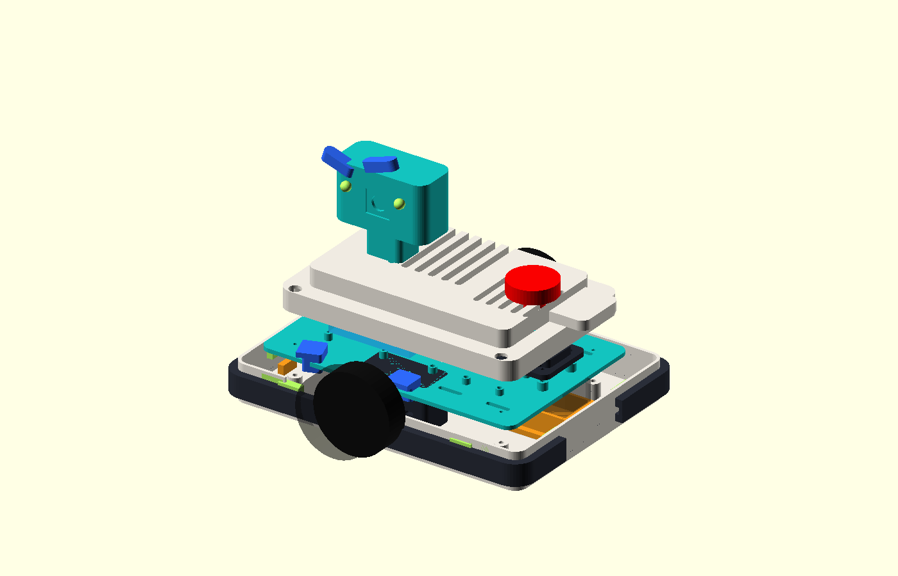
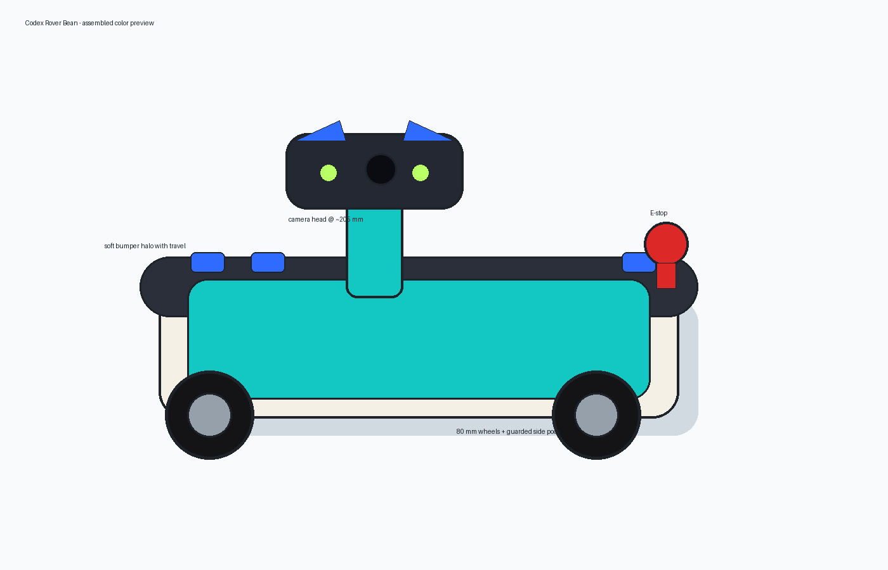
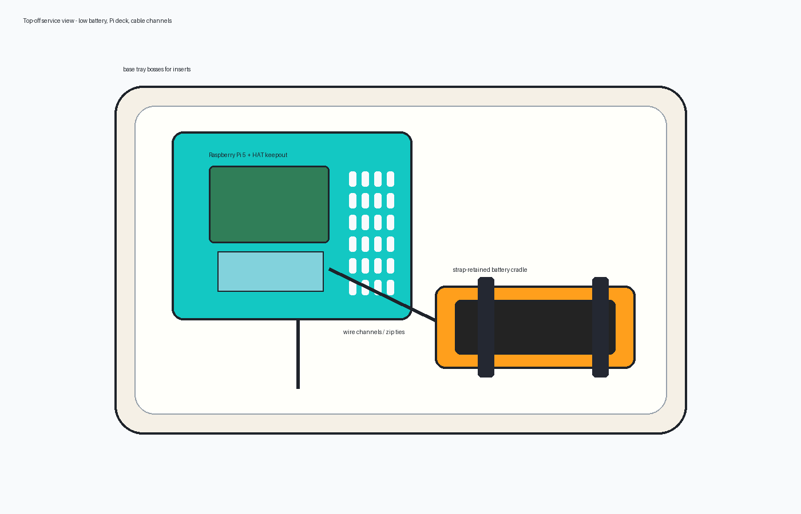
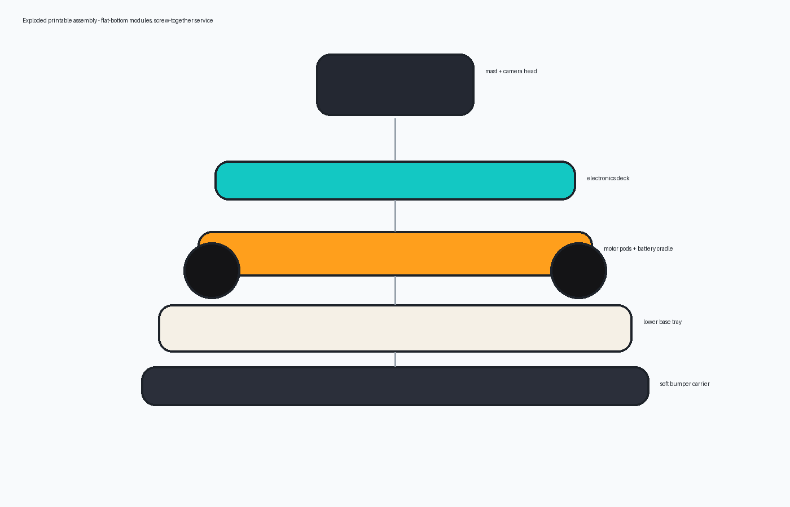
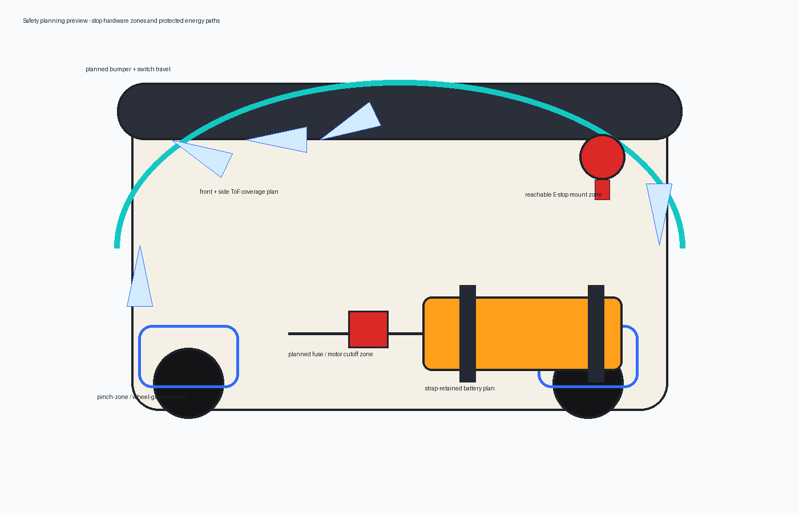
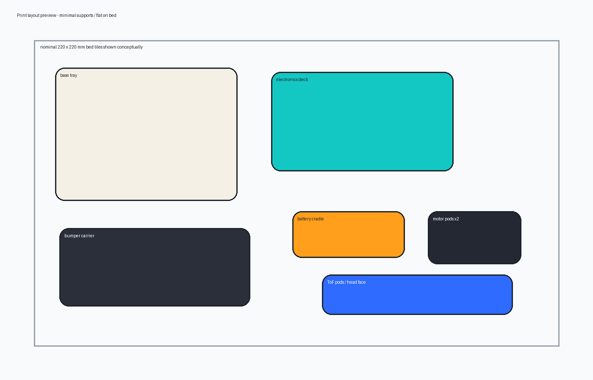

# CAD v0 Body Concept: Codex Rover Bean

This first CAD pass gives Codex a compact, printable differential-drive body with a friendly camera head, soft bumper halo, and serviceable layered chassis. The look is intentionally a little like a tiny helpful space bean: warm cream shell, teal deck, blue brow accents, lime status eyes, dark rubber bumper and wheels, and a very obvious red E-stop.

Nominal v0 envelope: **300 mm long**, **220 mm wide**, **80 mm wheels**, **42 mm axle height**, and a camera lens target in the **180-240 mm from floor** range once the head is mounted. The 300 mm tray may need to become a split tray if the confirmed printer bed cannot handle a 300 x 220 mm footprint.

## Preview Renders

| View | Purpose |
| --- | --- |
|  | Source assembly preview generated directly from `cad/openscad/codex_body_assembly.scad`. |
|  | Assembled color preview showing the camera head, bumper halo, side wheels, ToF pods, and top E-stop. |
|  | Top-off service view showing the Pi deck, battery cradle, straps, and cable channels. |
|  | Exploded stack showing the lower tray, bumper carrier, motor/battery layer, electronics deck, and head. |
|  | Safety planning preview showing planned E-stop, bumper/switch, battery strap, motor cutoff, pinch-zone, and ToF coverage areas. |
|  | Print-orientation preview showing flat-bottom modules and split-print strategy for smaller beds. |

The labeled PNG previews are generated by `scripts/render_cad_v0_previews.py` so review images can be refreshed without hand-editing binary assets. They are **concept preview illustrations**, not manufacturing exports. The OpenSCAD assembly PNG is generated from the source assembly for geometry-rendered inspection.

## Source CAD Files

- `cad/openscad/robot_params.scad` defines the shared mechanical contract: body envelope, wheel geometry, fasteners, electronics keepouts, battery, sensors, head dimensions, and render colors.
- `cad/openscad/base_tray.scad` models the lower printable tub with deck bosses, motor-pod anchors, caster pad, wheel well interruptions, and cable pass-throughs.
- `cad/openscad/electronics_deck.scad` models the removable Pi/electronics deck with Pi mounting standoffs, generic controller/regulator grids, vents, zip-tie slots, and a translucent future HAT/cooling keepout.
- `cad/openscad/battery_cradle.scad` models a low battery cradle with padding allowance, end stops, wire exit, and two strap slots.
- `cad/openscad/motor_pod.scad` models a bolt-in motor pod with slotted alignment holes, reinforced ribs, and a wheel clearance preview.
- `cad/openscad/bumper_carrier.scad` models a soft bumper carrier around the front/sides with compression travel, plus preview-only switch trigger tab placeholders.
- `cad/openscad/tof_sensor_pod.scad` models straight and angled ToF pods with a small hood and board mounting holes; the default export is one straight pod, with `tof_variant="layout"` available for comparison.
- `cad/openscad/camera_head_bracket.scad` models the front mast, camera-board holder, cable relief, and protective head shell; the brows and LED eyes are preview-only faceplate markers.
- `cad/openscad/top_service_shell.scad` models a shallow removable vented service shell with screw access, a speaker/status grille, a reinforced E-stop placeholder, and a small rear status-tail LED.
- `cad/openscad/estop_mount_plate.scad` models a separate reinforced E-stop plate with screw mounts, an anti-rotation notch placeholder, and motor-cut cable strain relief.
- `cad/openscad/split_print_variants.scad` provides smaller-bed variants for base tray halves, deck halves, seam plates, and bumper quadrants while keeping the one-piece parts available for large printers.
- `cad/openscad/codex_body_assembly.scad` assembles the modules into a colored review model.

Some source files include `preview_only()` geometry for placeholders such as the red E-stop cap, LED/status markers, microswitch blocks, and dummy keepouts. Those are visible in OpenSCAD preview renders but are intentionally excluded from STL export so a future print job does not accidentally include decorative or hardware-placeholder solids.

## Assembly Strategy

1. Print the lower base tray flat, open-side up.
2. Bolt the motor pods into the reinforced side anchors using metal screws, washers, and inserts.
3. Bolt the battery cradle low and slightly rearward of the wheel axle, then retain the pack with real straps through the printed slots.
4. Install the removable electronics deck above the lower tray; keep the Pi HAT/cooling keepout open for the future AI HAT+ 2 path.
5. Bolt the dedicated E-stop mount plate to the deck standoffs under the top-shell cutout, then route the motor-cut wiring through strain relief.
6. Mount ToF pods and bumper carrier around the front/side perimeter.
7. Mount the front mast/head after rolling-skeleton fit checks so head height and wobble can be evaluated safely.
8. Install the vented top service shell after cable routing is known; print the shell upside down or split it if the broad underside bridge causes slicer support problems.

## Safety Notes And Known Limitations

- This is a CAD v0 fit-check concept, not a release-ready drive chassis.
- The E-stop is included as a top/rear CAD placeholder, but final printable mount dimensions and motor-power cutoff hardware still need a dedicated hardware-specific part.
- The new E-stop plate gives the v0 a structural mount concept, but the final part still needs the actual switch datasheet, anti-rotation geometry, backing hardware, and motor-power cutoff wiring path validated.
- The bumper carrier includes travel, attachment holes, switch-tab placeholders, and preview-only microswitch blocks; exact microswitch geometry and a captured moving/fixed switch interface must be updated after switch selection.
- Motor pods use generic geometry and must be adapted to the selected gearmotor hole pattern before printing load-bearing parts.
- The battery cradle intentionally assumes straps/padding; printed plastic is not the only retention method.
- The one-piece base, bumper, and deck remain useful for large printers; `split_print_variants.scad` should be used first if the printer bed is limited to about 220 x 220 mm.
- Generated STL/STEP exports are not committed; source CAD is the review artifact for this PR.

## Refreshing Preview Images

```bash
python3 scripts/render_cad_v0_previews.py
```

If OpenSCAD is installed locally, refresh the source assembly preview with:

```bash
openscad -o docs/images/codex_body_openscad_assembly.png --preview --imgsize=1400,900 --viewall --autocenter --projection=o --camera=180,90,170,62,0,35,760 cad/openscad/codex_body_assembly.scad
```

You can also inspect the full color assembly interactively with:

```bash
openscad cad/openscad/codex_body_assembly.scad
```

For smaller printer beds, export one split part at a time:

```bash
openscad -D 'split_part="base_front"' -o cad/exports/stl/base_front.stl cad/openscad/split_print_variants.scad
openscad -D 'split_part="deck_left"' -o cad/exports/stl/deck_left.stl cad/openscad/split_print_variants.scad
openscad -D 'split_part="bumper_front_left"' -o cad/exports/stl/bumper_front_left.stl cad/openscad/split_print_variants.scad
```
